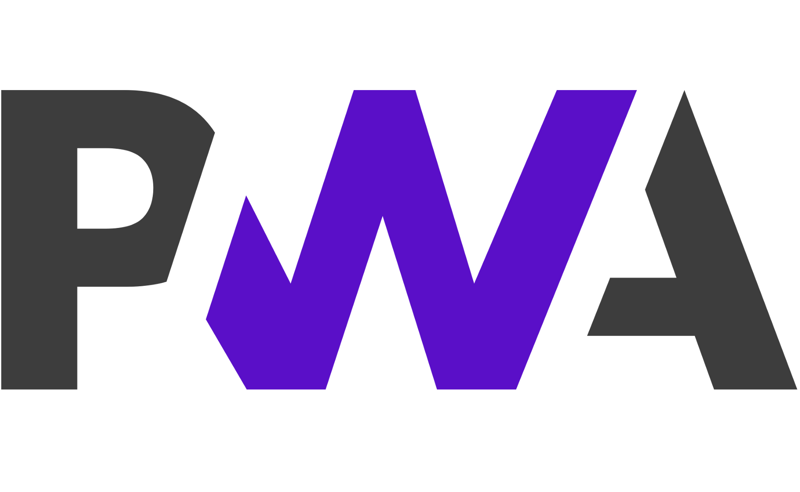

  
  <h1>PWA - Progressive Web App | Getting Started</h1>

## 강좌 소개

프로그레시브 웹 앱에 대한 전반적인 내용과 활용법에 대해 학습할 수 있는 기초 강좌입니다.  
각 챕터는 블로그 포스팅과 예제 소스코드를 통해 직접 실습할 수 있도록 구성되어있으며 궁금한 내용은 블로그 댓글 또는 이메일로 보내주시면 됩니다.

> `웹 개발의 전반적인 이해`가 필요하며 자바스크립트 `ES6`에 대한 내용을 어느정도 알고 계셔야 진행하실 때 어려움이 없습니다.

### 실습 환경

- 브라우저 (Google Chrome 추천)
- 텍스트 에디터 혹은 IDE (본 강좌에서는 VSCode 사용)
- [Simple Server](https://github.com/leegeunhyeok/simple-server/releases/latest)

## 목차

- [프로그레시브 웹 앱 시작하기 (1) - PWA란?](https://blog.geundung.dev/85)
- [프로그레시브 웹 앱 시작하기 (2) - 서비스워커 등록](https://blog.geundung.dev/86)
- [프로그레시브 웹 앱 시작하기 (3) - 리소스 캐싱 및 Fetch](https://blog.geundung.dev/87)
- [프로그레시브 웹 앱 시작하기 (4) - 서비스워커 상태](https://blog.geundung.dev/88)
- [프로그레시브 웹 앱 시작하기 (5) - Push, 푸시 알림 1](https://blog.geundung.dev/94)
- [프로그레시브 웹 앱 시작하기 (6) - Push, 푸시 알림 2](https://blog.geundung.dev/95)

## 교육과정

- `Chapter 1` 프로그레시브 웹 앱 시작하기 (1) - PWA란?
  - PWA에 대한 기본 이론 학습
  - 예제 웹 서버 띄우기
  - 코드 분석
- `Chapter 2` 프로그레시브 웹 앱 시작하기 (2) - 서비스워커 등록
  - 서비스워커 등록하기
  - 서비스워커 생명주기
  - 브라우저 Fetch 가로채기
- `Chapter 3` 프로그레시브 웹 앱 시작하기 (3) - 리소스 캐싱 및 Fetch
  - 필요한 리소스 캐싱하기
  - 사용하지 않는 캐시 삭제하기
  - 오프라인 환경에서 캐싱된 데이터 응답하기
- `Chapter 4` 프로그레시브 웹 앱 시작하기 (4) - 서비스워커 상태
  - 서비스워커 상태 기초
  - 서비스워커 상태 변경 감지
- `Chapter 5` 프로그레시브 웹 앱 시작하기 (5) - Push, 푸시 알림 1
  - 푸시 알림 구독
  - 구독 정보 확인
  - 구독 상태 확인
  - 푸시 알림 받기
- `Chapter 6` 프로그레시브 웹 앱 시작하기 (6) - Push, 푸시 알림 2
  - 푸시 알림 클릭 이벤트
  - 푸시 알림 구독 취소
  - 브라우저 알림 권한 확인
- `Chapter 7` 준비 중..

## 이미지 출처

[링크](https://www.boredpanda.com/animals-hybrids-photoshop/?utm_source=google&utm_medium=organic&utm_campaign=organic)

## 진행자

- 이근혁
  - Github: [Geunhyeok LEE](https://github.com/leegeunhyeok)
  - E-Mail: [dev.ghlee@gmail.com](mailto:dev.ghlee@gmail.com)
